### Codegraph cục bộ

- Nguồn: 610 tệp mã; 425 liên kết import cục bộ.
- Hiển thị: 20/425 liên kết theo thứ tự ổn định.
- Phạm vi: chỉ import resolve được trong project; package ngoài không được đưa vào context.

```mermaid
graph TD
  n_3336306f72672f636f72652f706c7567696e2d6c6f616465722e6a73["360org/core/plugin-loader.js"] --> n_3336306f72672f636f72652f6361706162696c6974792d7365616d732e6a73["360org/core/capability-seams.js"]
  n_3336306f72672f636f72652f706c7567696e2d6c6f616465722e6a73["360org/core/plugin-loader.js"] --> n_3336306f72672f636f72652f6576656e742d6275732e6a73["360org/core/event-bus.js"]
  n_3336306f72672f636f72652f73656c662d746573742e6a73["360org/core/self-test.js"] --> n_3336306f72672f636f72652f6361706162696c6974792d7365616d732e6a73["360org/core/capability-seams.js"]
  n_3336306f72672f636f72652f73656c662d746573742e6a73["360org/core/self-test.js"] --> n_3336306f72672f636f72652f6576656e742d6275732e6a73["360org/core/event-bus.js"]
  n_3336306f72672f636f72652f73656c662d746573742e6a73["360org/core/self-test.js"] --> n_3336306f72672f636f72652f706c7567696e2d6c6f616465722e6a73["360org/core/plugin-loader.js"]
  n_3336306f72672f706c7567696e732f3336302d6169726f757465722f696e6465782e6a73["360org/plugins/360-airouter/index.js"] --> n_3336306f72672f636f72652f73616e64626f782d7365616d2e6a73["360org/core/sandbox-seam.js"]
  n_3336306f72672f706c7567696e732f3336302d636176656d616e2f70726f6d7074732f7265666572656e6365732f636176656d616e2d636f6d70726573732f736372697074732f5f5f6d61696e5f5f2e7079["360org/plugins/360-caveman/prompts/references/caveman-compress/scripts/__main__.py"] --> n_3336306f72672f706c7567696e732f3336302d636176656d616e2f70726f6d7074732f7265666572656e6365732f636176656d616e2d636f6d70726573732f736372697074732f636c692e7079["360org/plugins/360-caveman/prompts/references/caveman-compress/scripts/cli.py"]
  n_3336306f72672f706c7567696e732f3336302d636176656d616e2f70726f6d7074732f7265666572656e6365732f636176656d616e2d636f6d70726573732f736372697074732f62656e63686d61726b2e7079["360org/plugins/360-caveman/prompts/references/caveman-compress/scripts/benchmark.py"] --> n_3336306f72672f706c7567696e732f3336302d636176656d616e2f70726f6d7074732f7265666572656e6365732f636176656d616e2d636f6d70726573732f736372697074732f76616c69646174652e7079["360org/plugins/360-caveman/prompts/references/caveman-compress/scripts/validate.py"]
  n_3336306f72672f706c7567696e732f3336302d636176656d616e2f70726f6d7074732f7265666572656e6365732f636176656d616e2d636f6d70726573732f736372697074732f636c692e7079["360org/plugins/360-caveman/prompts/references/caveman-compress/scripts/cli.py"] --> n_3336306f72672f706c7567696e732f3336302d636176656d616e2f70726f6d7074732f7265666572656e6365732f636176656d616e2d636f6d70726573732f736372697074732f636f6d70726573732e7079["360org/plugins/360-caveman/prompts/references/caveman-compress/scripts/compress.py"]
  n_3336306f72672f706c7567696e732f3336302d636176656d616e2f70726f6d7074732f7265666572656e6365732f636176656d616e2d636f6d70726573732f736372697074732f636c692e7079["360org/plugins/360-caveman/prompts/references/caveman-compress/scripts/cli.py"] --> n_3336306f72672f706c7567696e732f3336302d636176656d616e2f70726f6d7074732f7265666572656e6365732f636176656d616e2d636f6d70726573732f736372697074732f6465746563742e7079["360org/plugins/360-caveman/prompts/references/caveman-compress/scripts/detect.py"]
  n_3336306f72672f706c7567696e732f3336302d636176656d616e2f70726f6d7074732f7265666572656e6365732f636176656d616e2d636f6d70726573732f736372697074732f636f6d70726573732e7079["360org/plugins/360-caveman/prompts/references/caveman-compress/scripts/compress.py"] --> n_3336306f72672f706c7567696e732f3336302d636176656d616e2f70726f6d7074732f7265666572656e6365732f636176656d616e2d636f6d70726573732f736372697074732f6465746563742e7079["360org/plugins/360-caveman/prompts/references/caveman-compress/scripts/detect.py"]
  n_3336306f72672f706c7567696e732f3336302d636176656d616e2f70726f6d7074732f7265666572656e6365732f636176656d616e2d636f6d70726573732f736372697074732f636f6d70726573732e7079["360org/plugins/360-caveman/prompts/references/caveman-compress/scripts/compress.py"] --> n_3336306f72672f706c7567696e732f3336302d636176656d616e2f70726f6d7074732f7265666572656e6365732f636176656d616e2d636f6d70726573732f736372697074732f76616c69646174652e7079["360org/plugins/360-caveman/prompts/references/caveman-compress/scripts/validate.py"]
  n_3336306f72672f706c7567696e732f3336302d636176656d616e2f70726f6d7074732f7265666572656e6365732f636f6d70696c652e6d6a73["360org/plugins/360-caveman/prompts/references/compile.mjs"] --> n_3336306f72672f706c7567696e732f3336302d636176656d616e2f70726f6d7074732f7265666572656e6365732f76657262732d676174652e6d6a73["360org/plugins/360-caveman/prompts/references/verbs-gate.mjs"]
  n_3336306f72672f706c7567696e732f3336302d7375706572706f776572732f696e6465782e6a73["360org/plugins/360-superpowers/index.js"] --> n_3336306f72672f636f72652f6167656e742d706970656c696e652e6a73["360org/core/agent-pipeline.js"]
  n_3336306f72672f736372697074732f686f6f6b732f616961632d686f6f6b2d6272696467652e6a73["360org/scripts/hooks/aiac-hook-bridge.js"] --> n_3336306f72672f636f72652f706c7567696e2d6c6f616465722e6a73["360org/core/plugin-loader.js"]
  n_6563635f64617368626f6172642e7079["ecc_dashboard.py"] --> n_736372697074732f6c69622f6563635f64617368626f6172645f72756e74696d652e7079["scripts/lib/ecc_dashboard_runtime.py"]
  n_696e746567726174696f6e732f617572612f5f5f696e69745f5f2e7079["integrations/aura/__init__.py"] --> n_696e746567726174696f6e732f617572612f616461707465722e7079["integrations/aura/adapter.py"]
  n_736372697074732f6175746f2d7570646174652e6a73["scripts/auto-update.js"] --> n_736372697074732f6c69622f696e7374616c6c2d6c6966656379636c652e6a73["scripts/lib/install-lifecycle.js"]
  n_736372697074732f6175746f2d7570646174652e6a73["scripts/auto-update.js"] --> n_736372697074732f6c69622f696e7374616c6c2d6d616e6966657374732e6a73["scripts/lib/install-manifests.js"]
  n_736372697074732f636174616c6f672e6a73["scripts/catalog.js"] --> n_736372697074732f6c69622f696e7374616c6c2d6d616e6966657374732e6a73["scripts/lib/install-manifests.js"]
  more["… 405 liên kết đã lược bỏ"]
```

