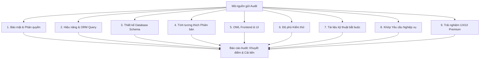

# Quy trình Audit & Đánh giá Mã nguồn Cuối cùng (Final Audit & Code Review)

Tài liệu này định nghĩa quy trình Audit cuối cùng dành riêng cho **Product Owner / Lead Developer** (Người dùng) để đánh giá chất lượng sản phẩm/module Odoo do nhân viên hoặc đối tác gửi lên trước khi merge vào nhánh Production và bàn giao.

> [!IMPORTANT]
> Vì quy trình này vô cùng quan trọng nhằm đảm bảo chất lượng sản phẩm đầu ra đạt tiêu chuẩn cao nhất về cả kỹ thuật lẫn trải nghiệm người dùng, AI Agent **bắt buộc phải sử dụng mô hình AI cao cấp nhất (ví dụ: Gemini 1.5 Pro hoặc Gemini 3.5 Pro)** có năng lực suy luận sâu và đa phương thức (Multimodal) để xử lý.

> [!IMPORTANT]
> **Tiêu chuẩn audit = CAO HƠN tiêu chuẩn Odoo official**, không phải chỉ "đạt chuẩn Odoo". Odoo core tự nó vẫn có code cũ, view legacy, hoặc chỗ dùng vanilla JS do lịch sử — module audit **không được lấy code Odoo core làm chuẩn để bào chữa** cho việc dùng kỹ thuật lỗi thời. Bất kỳ pattern nào trong module bị audit mà thấp hơn tiêu chuẩn hiện đại nhất (OWL 2.x/3.x, `models.Constraint()`/`models.Index()`, bỏ `attrs=`, toán tử `any!`) đều phải bị gắn cờ, kể cả khi Odoo core ở version đó vẫn còn dùng cách cũ.

---

## 1. Cách thức Thực hiện Audit Nhanh của Product Owner

Khi Product Owner cung cấp mã nguồn (hoặc đường dẫn thư mục module trong môi trường dev) kèm yêu cầu:
> *"Hãy audit giúp anh mã nguồn/module này"* hoặc sử dụng lệnh `/audit <path_to_module>`

AI Agent sẽ tự động phân tích mã nguồn dựa trên bộ checklist 9 khía cạnh dưới đây và xuất ra **Báo cáo Đánh giá Cuối cùng** chi tiết.

---

## 2. Bộ Checklist Audit Final 9 Khía Cạnh (Audit Checklist)

Khi tiến hành audit final, AI Agent sử dụng mô hình tối cao để đánh giá mã nguồn dựa trên các tiêu chí sau:



### 🥇 Khía cạnh 1: Bảo mật & Phân quyền (Security & Permissions)
*   **Access Rights (ACL):** Mọi model mới định nghĩa bắt buộc phải được khai báo quyền truy cập trong `security/ir.model.access.csv` cho từng nhóm người dùng (groups). Không được bỏ sót model nào.
*   **Record Rules (`ir.rule`):** Kiểm tra xem có thiết lập các quy tắc lọc dữ liệu theo Chi nhánh/Công ty (`multi-company`) hoặc theo người sở hữu (`personal data`) hay không.
*   **Sử dụng `sudo()`:** Audit việc sử dụng `sudo()`. Chỉ cho phép bypass quyền khi thực sự cần thiết cho nghiệp vụ hệ thống và biến/phạm vi dữ liệu phải được giới hạn chặt chẽ (Tránh SQL Injection hoặc rò rỉ dữ liệu).

### 🥈 Khía cạnh 2: Hiệu năng & Tối ưu hóa truy vấn (Performance & ORM Query)
*   **Tránh N+1 Query:** Phát hiện các đoạn code duyệt qua một tập hợp bản ghi (records) và gọi computed fields, fields quan hệ, hoặc thực hiện phương thức search/write bên trong vòng lặp. Yêu cầu viết lại bằng `mapped()`, `filtered()`, hoặc prefetch dữ liệu.
*   **Database Indexing:** Các trường thường xuyên được sử dụng trong domain lọc (`domain=[]`), tìm kiếm hoặc sắp xếp (`_order`) phải được đánh chỉ mục (`index=True` hoặc định nghĩa trong `_sql_indexes` trên v19).
*   **Computed Fields:** Các trường computed phải có `@api.depends` chính xác và đầy đủ. Hạn chế sử dụng `store=True` khi không thực sự cần tìm kiếm/sắp xếp để giảm tải ghi DB.

### 🥉 Khía cạnh 3: Thiết kế Database Schema
*   **Mối quan hệ Model:** Sử dụng MCP Tool `odoo-graph-mcp` để vẽ và audit sơ đồ quan hệ. Tránh việc thiết kế liên kết vòng (circular references) hoặc thiết kế quan hệ Many2many dư thừa khi chỉ cần Many2one.
*   **Ràng buộc dữ liệu (Constraints):** Đánh giá tính toàn vẹn dữ liệu. Các ràng buộc đơn giản nên dùng SQL Constraints (`_sql_constraints` hoặc `models.Constraint` trên v19) thay vì Python `@api.constrains` để tăng hiệu năng.

### 🏅 Khía cạnh 4: Tính tương thích & Chuẩn hóa code (Compatibility & Style)
*   **Loại bỏ mã lỗi thời (Deprecated Code):** 
    *   Với Odoo v17-v19: Không được phép sử dụng thuộc tính `attrs` trong XML views (phải dùng trực tiếp `invisible`, `readonly`, `required`).
    *   Không sử dụng các phương thức ORM cũ đã bị khai tử (như `search_read()` sai cú pháp, hoặc `name_get()` trên Odoo v17+).
    *   x2many dùng `Command` class (v16+) thay tuple `(0,0,{...})`; nối SQL an toàn qua `SQL()` builder thay f-string/nối chuỗi vào `cr.execute()` (v18+). Tra bảng đầy đủ + cách tự verify claim "bắt buộc" ở
        [version-compatibility-matrix.md](version-compatibility-matrix.md).
*   **Định dạng PEP8 & Cấu trúc:** File code Python phải sạch, đặt tên biến rõ nghĩa theo quy chuẩn Odoo, tổ chức thư mục module đúng chuẩn (`models/`, `views/`, `security/`, `static/`, `data/`).

### 🏅 Khía cạnh 5: OWL Frontend & Custom UI — ƯU TIÊN CAO NHẤT, bắt buộc soi kỹ

> [!WARNING]
> Đây là khía cạnh bị audit nghiêm ngặt nhất trong 9 khía cạnh. Mặc định của module Odoo phải là **OWL trước, JS thuần chỉ khi OWL thực sự không cover được** (ví dụ: tích hợp thư viện ngoài bắt buộc thao tác DOM trực tiếp, hoặc patch một widget legacy chưa migrate lên OWL).

*   **Quét JS thuần có thể thay bằng OWL (bắt buộc, không được bỏ qua):**
    - Grep mọi file `.js` trong `static/src/` không nằm trong OWL Component (`Component`, `useState`, `onMounted`...) hoặc không dùng `owl` import.
    - Với mỗi file/đoạn JS thuần thao tác DOM (`document.querySelector`, `addEventListener`, thao tác `innerHTML`, jQuery selector `$(...)`) mà đang implement 1 khối UI tương tác (dropdown, modal, widget field, dashboard block...) → **cảnh báo rõ**: `⚠️ [file.js:Lxx] Đang dùng JS thuần cho <mô tả UI>. OWL Component (state reactivity + template) có thể thay thế, khuyến nghị migrate.`
    - Chỉ được miễn cảnh báo khi: (a) đoạn JS chỉ để patch/extend 1 widget legacy core chưa lên OWL, có comment giải thích rõ, hoặc (b) tích hợp thư viện bên thứ 3 (charting, map, editor ngoài) không có binding OWL sẵn.
*   **Tính cô lập của Component:** Các OWL Component custom không được ghi đè CSS core ảnh hưởng xấu đến layout toàn hệ thống.
*   **OWL Patching:** Sử dụng đúng cú pháp `patch` của OWL (ví dụ: `patch(ActivityMenu.prototype, ...)` trên v17+) thay vì clone lại toàn bộ file JS core.
*   **OWL hiện đại, không lỗi thời:** Ưu tiên OWL 2.x/3.x (`useState`, `useRef`, `onWillStart`, hooks) — cảnh báo nếu vẫn dùng pattern OWL 1.x hoặc widget Legacy `Widget`/`publicWidget` khi không bắt buộc phải tương thích ngược.
*   **State reactivity đúng chuẩn:** Component quản lý state qua `useState`/props, không tự ý thao tác DOM song song với reactivity của OWL (tránh xung đột 2 nguồn sự thật).
*   **Assets Bundling:** Khai báo đúng assets bundle trong `__manifest__.py` dưới key `'assets'`.

### 🏅 Khía cạnh 6: Độ phủ Kiểm thử (Testing)
*   **Unittests Python:** Có file test đặt tại thư mục `tests/`. Các hàm test phải kiểm thử được cả trường hợp dữ liệu đúng (happy path) và dữ liệu lỗi (edge cases).
*   **UI/Tour Tests:** Với các tính năng nghiệp vụ phức tạp ở Frontend, phải có kịch bản tour test hoặc Playwright test.

### 🏅 Khía cạnh 7: Tài liệu Dự án bắt buộc (Mandatory Docs)
*   Kiểm tra xem module có đầy đủ 5 file bắt buộc: `SPEC.md`, `ARCH.md`, `README.md`, `DEPLOY_GUIDE.md`, và `CHANGELOGS.md`.
*   Tệp `__manifest__.py` phải có chứa key `'changelog'` mô tả ngắn gọn lịch sử thay đổi phiên bản dành cho người dùng cuối.

### 💎 Khía cạnh 8: Khớp Yêu cầu Nghiệp vụ & Khách hàng (Business & Feature Alignment)
*   **Đối chiếu Đặc tả (SPEC):** So khớp trực tiếp logic code, cấu trúc model, workflow nghiệp vụ với tài liệu đặc tả SPEC.md hoặc yêu cầu chi tiết từ khách hàng.
*   **Tính đúng & Tính đủ:** Kiểm tra xem tính năng đã đáp ứng đầy đủ kịch bản sử dụng thực tế chưa, có bị thiếu hụt trường thông tin quan trọng hay sai lệch quy trình nghiệp vụ yêu cầu hay không.

### 💎 Khía cạnh 9: Trải nghiệm UX/UI Premium (Premium UX/UI & Usability)
*   **Thẩm mỹ & Bố cục:** Đánh giá thiết kế layout của XML views (Form view có trực quan, Kanban view có hiện đại, Search view có đủ bộ lọc thông minh không?).
*   **Tính Phản hồi & Tương tác:** 
    *   Các OWL Component custom phải hoạt động mượt mà, có hiệu ứng hover/active rõ ràng.
    *   Phải thiết lập trạng thái tải dữ liệu (`loading skeletons`/`spinners`) khi gọi RPC để tránh đơ màn hình.
    *   Bắt buộc xử lý và thông báo lỗi thân thiện (friendly error messages) thay vì hiển thị trực tiếp stack trace kỹ thuật cho khách hàng.

---

## 3. Cấu trúc Báo cáo Audit Cuối cùng (Audit Report Template)

Khi thực thi audit, AI Agent xuất báo cáo theo định dạng đầy đủ sau để Product Owner dễ dàng ra quyết định:

```markdown
# BÁO CÁO AUDIT MÃ NGUỒN CUỐI CÙNG: [Tên Module / Dự án]
**Người yêu cầu:** Product Owner  
**Model AI thực thi:** Gemini 1.5/3.5 Pro (hoặc tương đương hạng cao nhất)  
**Ngày đánh giá:** [YYYY-MM-DD]

---

## 📊 Bảng Tóm tắt Audit (Mức độ Ưu tiên & Màu sắc)

| Mức độ | Vấn đề phát hiện | Vị trí file | Ảnh hưởng thực tế | Giải pháp đề xuất |
| :---: | :--- | :--- | :--- | :--- |
| 🔴 **CRITICAL** | [Lỗi nguy cấp] | [File path] | [Ví dụ: Widget mất hoạt động hoàn toàn khi chuyển trang AJAX] | [Giải pháp khắc phục] |
| 🟠 **CAO** | [Lỗi hiệu năng/bảo mật] | [File path] | [Ví dụ: SQL query trong vòng lặp làm chậm hệ thống] | [Giải pháp khắc phục] |
| 🟡 **TRUNG BÌNH** | [Lỗi cấu hình/kiến trúc] | [File path] | [Ví dụ: Nhúng inline script vi phạm bảo mật CSP] | [Giải pháp khắc phục] |
| 🟢 **THẤP** | [Khuyến nghị cải tiến] | [File path] | [Ví dụ: Các class icon không đồng bộ FontAwesome] | [Giải pháp khắc phục] |

---

## 📊 Đánh giá Tổng quan (Overview Dashboard)

| Khía Cạnh | Điểm Đánh Giá | Ghi Chú |
|---|---|---|
| 💎 Khớp Yêu cầu Nghiệp vụ | ✅ Đạt / ⚠️ Sai lệch / ❌ Thiếu tính năng | ... |
| 💎 Trải nghiệm UX/UI Premium | ✅ WOW - Premium / ⚠️ Đạt / ❌ UX kém | ... |
| 🥇 Bảo mật & Phân quyền | ✅ Đạt / ⚠️ Cảnh báo / ❌ Chưa đạt | ... |
| 🥈 Hiệu năng ORM | ✅ Tối ưu / ⚠️ Cần cải thiện / ❌ Kém | ... |
| 🥉 Thiết kế DB Schema | ✅ Tốt / ⚠️ Dư thừa / ❌ Sai thiết kế | ... |
| 🏅 Tính tương thích Phiên bản | ✅ Đúng v19 / ⚠️ Dùng deprecated | ... |
| 🏅 OWL Frontend & UI **[ƯU TIÊN CAO NHẤT]** | ✅ 100% OWL hiện đại / ⚠️ Còn JS thuần có thể thay bằng OWL / ❌ Lạm dụng JS thuần, Legacy Widget | Liệt kê rõ từng file JS thuần khuyến nghị migrate |
| 🏅 Test Coverage | ✅ Tốt / ⚠️ Thiếu case | ❌ Không có test |
| 🏅 Tài liệu bắt buộc | ✅ Đầy đủ 5 files / ❌ Thiếu [tên file] | ... |

---

## 💎 Đánh giá Nghiệp vụ & Trải nghiệm Người dùng (Dành riêng cho Product Owner)

### Khớp Yêu cầu Nghiệp vụ (Specs Alignment)
*So khớp tính năng với SPEC.md hoặc yêu cầu khách hàng đã thống nhất.*

- **✅ Đã đáp ứng đúng:** [Danh sách tính năng đã khớp specs]
- **⚠️ Sai lệch logic:** [Mô tả cụ thể điểm sai lệch so với specs, kèm dòng code liên quan]
- **❌ Thiếu tính năng:** [Danh sách tính năng được yêu cầu trong Specs nhưng chưa được implement]

### Trải nghiệm UX/UI & Usability (UX/UI Review)
*Đánh giá dưới góc nhìn của khách hàng cuối.*

- **Bố cục & Thẩm mỹ:** [Đánh giá tổng thể Form view, List view, Kanban, Dashboard...]
- **Điểm trải nghiệm tốt:** [Những điểm UX thực sự mượt mà, nổi bật]
- **Điểm trải nghiệm cần cải tiến:** [Những điểm gây khó chịu, confuse hoặc hiển thị kém cho người dùng]

---

## 🔍 Chi tiết Điểm Khuyết điểm Kỹ thuật (Technical Issues)
*Liệt kê chính xác file, dòng code gây ra lỗi kỹ thuật và phân loại cụ thể theo màu sắc.*

### 1. Nhóm 🔴 CRITICAL (Lỗi chức năng nguy cấp)
*   **[Tên lỗi] tại [file.py:L45](file:///absolute/path/to/file.py#L45):**
    *   *Chi tiết:* [Mô tả kỹ thuật lỗi]
    *   *Hậu quả:* [Ảnh hưởng thực tế lên hệ thống / người dùng]

### 2. Nhóm 🟠 CAO (Ảnh hưởng hiệu năng & bảo mật nghiêm trọng)
*   **[Tên lỗi] tại [file.py:L45](file:///absolute/path/to/file.py#L45):**
    *   *Chi tiết:* [Mô tả kỹ thuật lỗi]
    *   *Hậu quả:* [Ảnh hưởng thực tế]

### 3. Nhóm 🟡 TRUNG BÌNH (Bảo mật, Cấu hình & Tiêu chuẩn)
*   **[Tên lỗi] tại [file.py:L45](file:///absolute/path/to/file.py#L45):**
    *   *Chi tiết:* [Mô tả kỹ thuật lỗi]
    *   *Hậu quả:* [Ảnh hưởng thực tế]

### 4. Nhóm 🟢 THẤP (Xem xét cải tiến sau)
*   **[Tên lỗi] tại [file.py:L45](file:///absolute/path/to/file.py#L45):**
    *   *Chi tiết:* [Mô tả kỹ thuật lỗi]

---

## 💡 Đề xuất Cải tiến (Improvements & Recommendations)
*Các phương án refactor và tính năng có thể cải tiến để nâng cao chất lượng sản phẩm.*

1.  **[Tên cải tiến]:** [Mô tả giải pháp, kèm code mẫu nếu cần]

---

## 🏁 Kết luận & Quyết định Ship (Ship Readiness)
*   **[ ] ✅ SẴN SÀNG SHIP (APPROVED):** Tính năng khớp specs, UX/UI tốt, code sạch & bảo mật. Có thể merge ngay lên Production.
*   **[ ] ⚠️ SHIP VỚI ĐIỀU KIỆN (CONDITIONAL SHIP):** Chấp nhận nhưng yêu cầu nhân viên sửa các điểm nhỏ sau trong sprint tiếp theo: [danh sách].
*   **[ ] ❌ CẦN SỬA LẠI (REWORK REQUIRED):** Có khuyết điểm nghiêm trọng. Yêu cầu nhân viên sửa và nộp lại trước khi được xem xét tiếp.
```

---

## 4. Lưu ý cho Agent khi thực thi Final Audit

> [!CAUTION]
> Đây là quy trình dành riêng cho **Product Owner**. Agent phải dành phần lớn sự chú ý vào hai khía cạnh số **8 (Khớp Specs)** và **9 (UX/UI Premium)** vì đây là điểm cốt lõi của bài đánh giá từ góc nhìn Product Owner. Các khía cạnh kỹ thuật (1-7) là nền tảng bắt buộc đạt, nhưng chất lượng sản phẩm cuối cùng được quyết định bởi trải nghiệm khách hàng và sự phù hợp với yêu cầu nghiệp vụ.

Khi thực thi:
1. **Bắt buộc dùng model AI cao nhất có sẵn** (ưu tiên Gemini 3.5 Pro, Claude Sonnet Thinking hoặc tương đương) để đảm bảo năng lực suy luận sâu và phân tích chéo nhiều file.
2. **Đọc toàn bộ mã nguồn** từ `__manifest__.py`, `models/`, `views/`, `security/`, `static/`, `tests/` trước khi viết báo cáo.
3. **Dùng `odoo-graph-mcp`** để visualize quan hệ models và kiểm tra tính toàn vẹn database schema.
4. **Không vội đưa ra kết luận** khi chưa đọc file `SPEC.md` hoặc tài liệu yêu cầu nghiệp vụ để đối chiếu.
5. **Tiêu chuẩn = cao hơn Odoo official, không phải bằng.** Không lấy code Odoo core (kể cả module chính hãng) làm cái cớ để chấp nhận kỹ thuật lỗi thời trong module đang audit.
6. **Luôn quét riêng khía cạnh 5 (OWL Frontend) kỹ hơn các khía cạnh khác** — bắt buộc liệt kê từng file JS thuần (`static/src/**/*.js` không phải OWL Component) và đánh giá xem OWL có thay thế được không. Không được bỏ qua bước này kể cả khi module không có yêu cầu UI phức tạp. Xác định đúng phiên bản OWL (2.x hay 3.x) trước khi chê/khen cú pháp — xem
   [owl-frontend.md §0](owl-frontend.md).
7. **Khi không chắc 1 API/pattern còn hợp lệ ở version đang audit hay không, verify trực tiếp trên Odoo core
   qua GitHub thay vì đoán** — dùng WebFetch trên
   `https://raw.githubusercontent.com/odoo/odoo/{version}.0/{path}` (vd. `odoo/models.py`, `odoo/api.py`,
   `addons/sale/models/sale_order.py`, `addons/sale/views/sale_order_views.xml`) để đọc chính code core cùng
   version, so khớp pattern thật thay vì suy diễn từ tên gọi hoặc trí nhớ có thể lỗi thời. Đây là bước bắt
   buộc trước khi khẳng định 1 pattern là "sai"/"lỗi thời" với PO nếu bảng trong
   [version-compatibility-matrix.md](version-compatibility-matrix.md)
   đánh dấu "chưa xác nhận chính thức".

