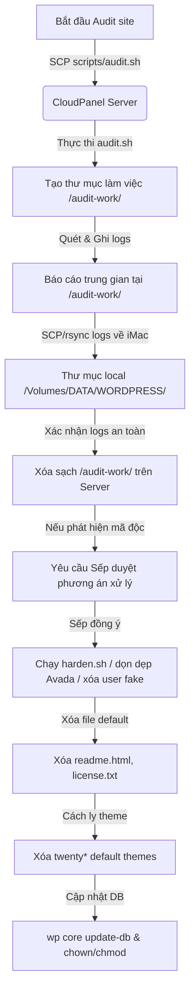

# Kiến trúc và Luồng dữ liệu (ARCH.md)

## 1. Sơ đồ Luồng Hoạt động (Audit & Hardening Pipeline)

---

## 2. Mô hình An toàn & Phân quyền (Security & Privilege Model)
*   **User thực thi**: Các script quét và WP-CLI phải được chạy dưới quyền của chính **user sở hữu website** (ví dụ: `sudo -u vanchuyen247 wp ...`), tuyệt đối không chạy bằng user `root` để tránh sinh ra các file có owner sai lệch khiến website bị lỗi Permission 500.
*   **Khóa cứng thuộc tính hệ thống**: Sử dụng lệnh `chattr +i` (sau khi khôi phục code sạch) cho các file cấu hình cốt lõi như `.htaccess`, `wp-config.php` để ngăn chặn malware tự ghi đè cấu hình, và mở khóa bằng `chattr -i` khi cần bảo trì/nâng cấp.
