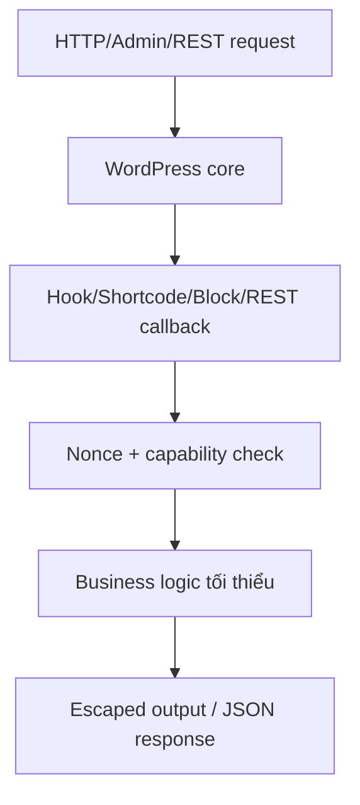

# ARCH — WordPress Dev

## Ranh giới

- `wp-dev` xử lý code theme/plugin/block/API.
- `securities` xử lý scan malware, hardening, audit server và incident response.

## Nguyên tắc

- WordPress native API trước.
- Diff nhỏ, không framework/dependency mới nếu không cần.
- Agent-map trước khi tạo hook/shortcode/REST route mới để tránh trùng.
