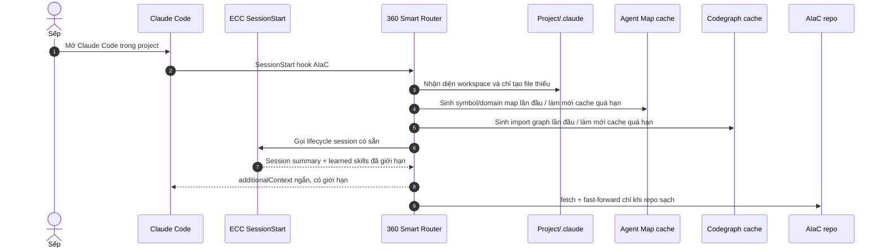

# ARCHITECTURE — AI Infrastructure as Code (AIaC)

AIaC là lớp overlay cho Claude Code: giữ ECC làm core, cô lập tài sản 360org và merge cấu hình thay vì ghi đè.

---

## 1. Sơ đồ vận hành



## 2. Ranh giới kiến trúc

```text
ECC upstream
    │
    ├── session summary, learned skills, instincts, observation,
    │   compaction, cost tracking, hook lifecycle
    │
AIaC overlay
    ├── CLAUDE.md                     # rule toàn cục đã kế thừa
    ├── config/claude/settings.overlay.json
    ├── scripts/aiac/merge-claude-settings.js
    ├── install-aiac.sh
    └── 360org/
        ├── skills/360-*              # domain skill không trùng ECC
        └── scripts/
            ├── hooks/360-smart-router.js
            ├── common/agent-map.py
            ├── common/codegraph.js
            └── odoo/

Claude state do Sếp sở hữu
    ├── ~/.claude/settings.json
    ├── ~/.claude/settings.local.json
    └── [project]/.claude/* đã tồn tại
```

AIaC không thay các thành phần ở vùng cuối. `install-aiac.sh` chỉ đồng bộ `~/.claude/360org`, đăng ký skill `360-*` nếu slot trống, backup trước khi quản lý Global `CLAUDE.md`, và merge duy nhất hook AIaC.

## 3. Tối ưu token

| Lớp | Cơ chế | Giới hạn |
|---|---|---|
| ECC | Session summary, learned skills, instincts, compaction | ECC tự giới hạn context SessionStart. |
| Router | Rule tóm tắt thay vì đọc nguyên skill | Tổng context AIaC tối đa 4.200 ký tự. |
| 360-agent-map | Symbol/domain/hotspot map nhẹ | Nạp tối đa 1.600 ký tự, dùng trước khi đọc sâu hoặc viết code. |
| Codegraph overview | Chỉ cạnh import cục bộ resolve được | Router yêu cầu 20 cạnh, nạp tối đa 900 ký tự. |
| 360-codegraph semantic | SQLite/AST symbol-call graph, CLI hoặc MCP project-local | Chỉ index và truy vấn khi audit/flow/impact hoặc bug fail 2 lần; không bật MCP global. |
| Skill đầy đủ | Progressive disclosure | Chỉ mở khi task khớp domain. |
| Log | Caveman/Ponytail | Lọc log trước khi đưa vào context; không in file/log lớn vô điều kiện. |

## 4. Học theo dự án và skill discovery

ECC là hệ học bền vững: session end lưu summary, observation/evaluation rút pattern, SessionStart chỉ nạp learned skill/instinct đủ confidence. AIaC không tạo bản sao lifecycle này.

Router tạo:

- `.claude/aiac/PROJECT_PROFILE.md`: dấu hiệu nhận diện, skill phù hợp và giới hạn codegraph.
- `.claude/aiac/SKILL_DISCOVERY.md`: chỉ khi chưa có skill chuyên biệt; yêu cầu kiểm tra kho sẵn có, nghiên cứu nguồn đáng tin, tạo draft local và kiểm chứng trước khi nâng thành skill dùng chung.

AIaC giữ audit capability tại `config/capabilities.manifest.json`; đây là danh sách quyết định giữ/gộp/bỏ/reference-only để agent không import trùng hoặc copy mù skill/plugin.

MCP chỉ đi qua catalog secret-free `config/mcp/catalog.json` và merge project-local bằng script; không có bước nào tự cài plugin, thêm MCP global, thay đổi quyền hoặc tự xuất dữ liệu dự án.

## 5. Cập nhật an toàn

`aiac-runtime.json` do installer tạo trong `~/.claude/360org` để Router biết vị trí clone AIaC, tránh hard-code đường dẫn máy. Router chỉ chạy `git fetch` + `git merge --ff-only` khi:

1. Có repo AIaC hợp lệ và upstream.
2. `git status --porcelain` rỗng.
3. Không có SessionStart khác đang cập nhật (lock tạm).

Nếu bất kỳ điều kiện nào không đạt, Router không thay đổi repo. Custom 360org vẫn được bảo vệ bởi namespace riêng và quy trình Git review/merge.
